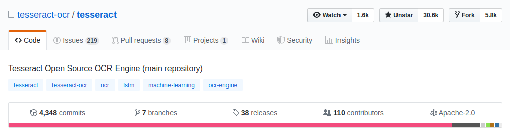
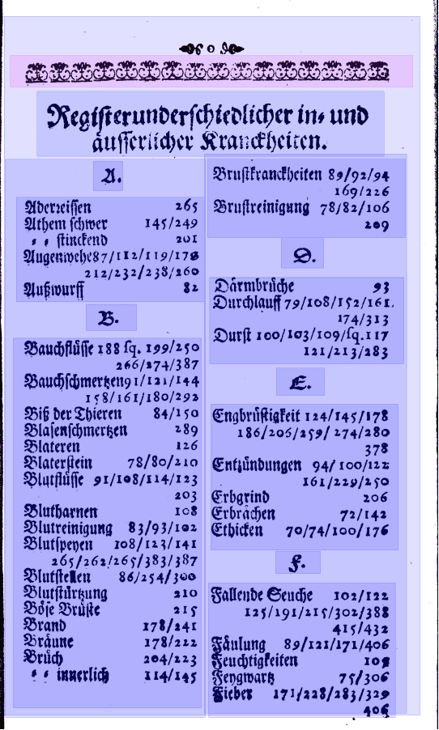
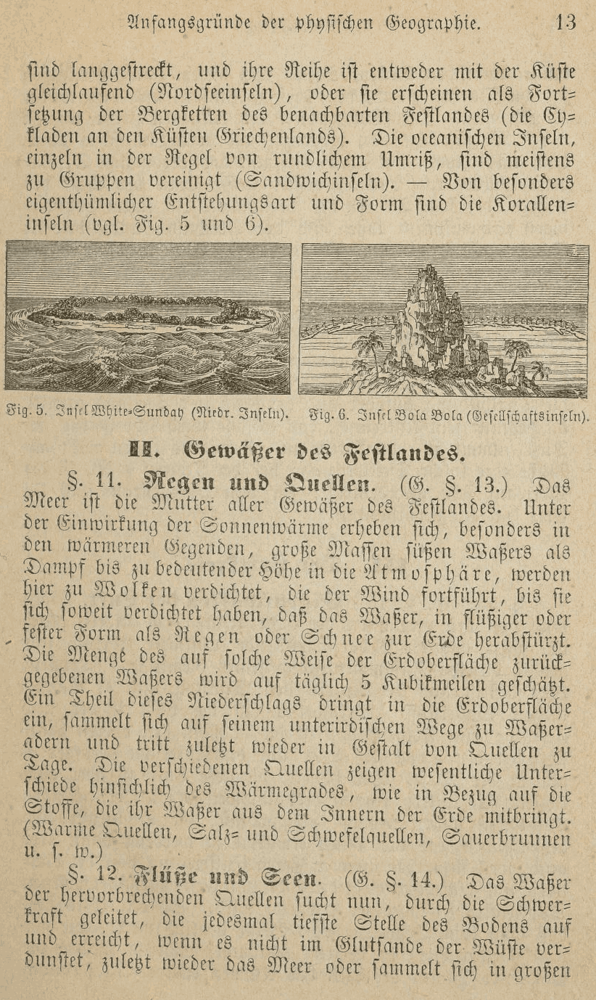
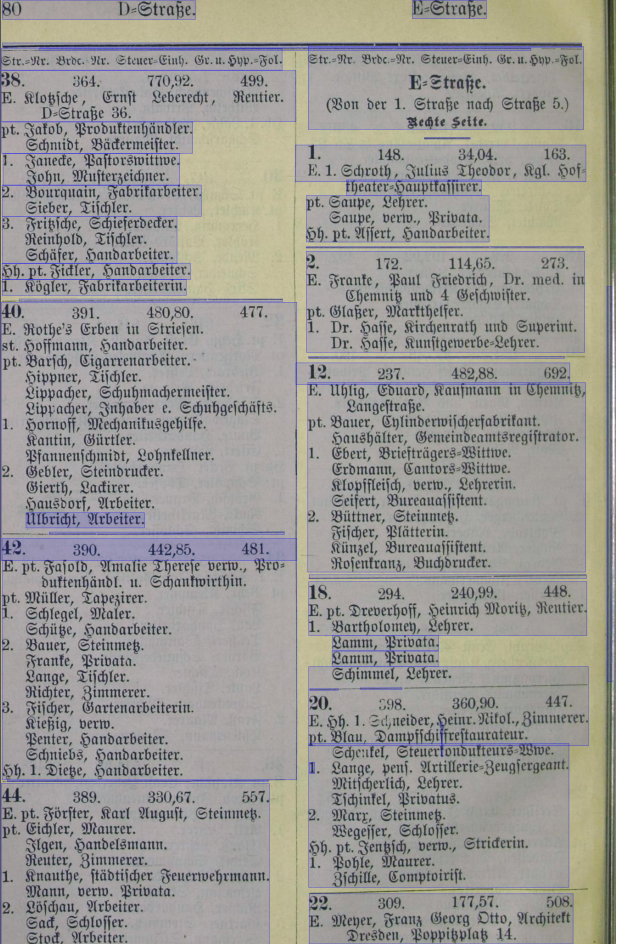
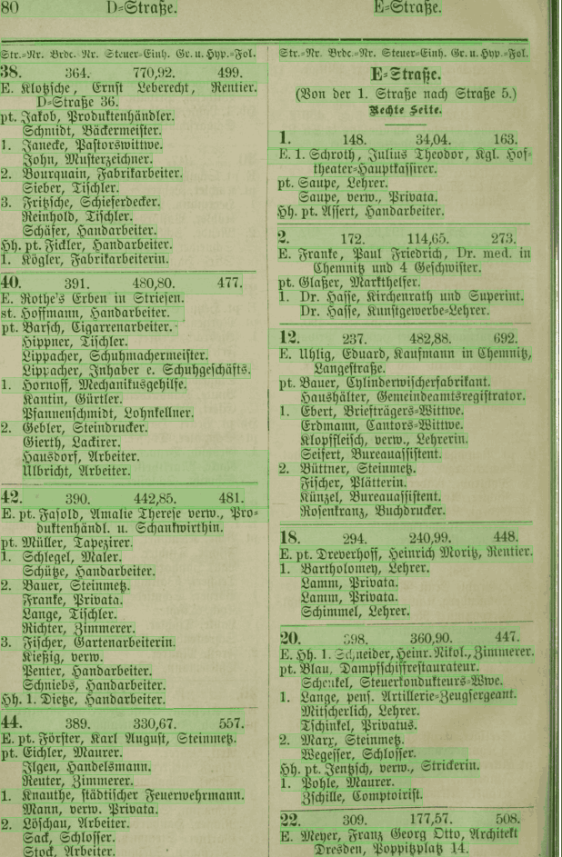
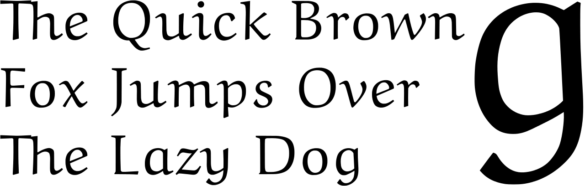

layout: true
  
<div class="my-header"></div>

<div class="my-footer">
  <table>
    <tr>
      <td style="text-align:right">Sächsische Landesbibliothek – Staats- und Universitätsbibliothek</td>
      <td>25.10.19</td>
      <td style="text-align:right"><a href="https://www.slub-dresden.de/">www.slub-dresden.de</a></td>
    </tr>
    <tr>
      <td style="text-align:right">Referat 2.5</td>
      <td />
    </tr>
  </table>
</div>

<div class="my-title-footer">
  <table>
    <tr>
      <td style="text-align:left"><b>Kay-Michael Würzner</b></td>
    </tr>
    <tr>
      <td style="text-align:left">Referat 2.5</td>
    </tr>
    <tr>
      <td style="font-size:8pt"><b>25. Oktober 2019</b></td>
    </tr>
    <tr>
      <td style="font-size:8pt">Open Access Week, SLUB Dresden</td>
    </tr>
  </table>
</div>

---

class: title-slide
count: false

# Vom Scan zum durchsuchbaren PDF mit Tesseract
## Ein Open-Source-Hands-on

---

# Überblick

- Einleitung
  + Was ist OCR?
  + Einsatzbeispiele
  + Tesseract
  + Open Source?
- Ablauf
  + Tesseract auf der Kommandozeile
  + Graphische Oberflächen für Tesseract
- Optimierungsoptionen
  + Bildvorverarbeitung
  + Modelltraining
  + Nachkorrektur

---

class: part-slide
count: false

# Was ist OCR?

---

# Was ist OCR?

.cols[
.sixty[
- Bilderfassung ≠ Texterfassung
- **O**ptical **C**haracter **R**ecognition: Automatische Erfassung von Text in Bildern
- ursprünglich begrenzt auf Zeichenerkennung
- heute häufig Synonym für den gesamten Texterfassungsprozess
  + Bildvorverarbeitung
  + Layoutanalyse (OLR)
  + Zeilenerkennung
  + ...
]
.fourty[
<center></center>
]
]

---

# Zeichenorientierte Ansätze

.cols[
.seventy[
- Erkennung erfolgt *glyphenweise*
  - **Mustervergleich**: Vergleich der Zeichenbilder zu in einem „Setzkasten“ gespeicherten Glyphen **Pixel für Pixel**
  - **Merkmalsvergleich**: Zerlegung der Glyphen in vordefinierte, bedeutungstragende **Eigenschaften** wie *Einfärbung*, *Kurven*, *Linien* etc. und Vergleich zu Referenzmaterialien
- Kombination beider Ansätze!
- Zerlegung der Seite in *Zeilen* und *Zeichen* notwendig
- Vorgehen in `ABBYY FineReader`
]
.fourty[
<center></center>
]
]

---

# Zeilenorientierte Ansätze

- Erkennung erfolgt *zeilenweise*
  1. **Skalierung:** einheitliche Höhe für alle Zeilen
  2. **Merkmalsextraktion**: Raster mit festgelegter Anzahl (horizontaler) Zeilen und variabler Anzahl (vertikaler) Spalten → Zeilen als Sequenzen binärwertiger Vektoren fixer Länge
<center></center>
- kontextsensitive Erkennung über *Übergangswahrscheinlichkeiten* der Vektoren
- Zerlegung der Seite in *Zeilen* notwendig
- Vorgehen *robuster* gegenüber Varianz durch Artefakte als zeichenorientierte Ansätze
- `Tesseract` (ab Version 4), `OCRopus`, `kraken`, `Calamari`
  + Einsatz *neuronaler Netze* für die Sequenzklassifikation

---

class: part-slide
count: false

# Einsatzbeispiele

---

# Einsatzbeispiele

.cols[
.sixty[
- typische Anwendungen
  - Nummernschilderkennung
]
.fourty[
<center>

<p style="font-size:4pt;">Image by Achim Raschka, CC BY-SA 3.0</p>
</center>
]
]

---

count: false

# Einsatzbeispiele

.cols[
.sixty[
- typische Anwendungen
  - Nummernschilderkennung
  - Captcha-Umgehung
]
.fourty[
<center>

<p style="font-size:4pt;">Image by JD, CC BY-SA 2.0</p>
</center>
]
]

---

count: false

# Einsatzbeispiele

.cols[
.sixty[
- typische Anwendungen
  - Nummernschilderkennung
  - Captcha-Umgehung
  - Schlüsselinformationsextraktion
]
.fourty[
<center>

<p style="font-size:4pt;">Image by Eluminary, CC BY-SA 2.0</p>
</center>
]
]

---

count: false

# Einsatzbeispiele

.cols[
.sixty[
- typische Anwendungen
  - Nummernschilderkennung
  - Captcha-Umgehung
  - Schlüsselinformationsextraktion
  - Handschrifterkennung
]
.fourty[
<center>

</center>
]
]

---

count: false

# Einsatzbeispiele

.cols[
.sixty[
- typische Anwendungen
  - Nummernschilderkennung
  - Captcha-Umgehung
  - Schlüsselinformationsextraktion
  - Handschrifterkennung
  - Volltextdigitalisierung
]
.fourty[
<center>

<p style="font-size:4pt;">Image by Uwe Springmann, CC BY-SA 4.0</p>
</center>
]
]

---

count: false

# Einsatzbeispiele

.cols[
.sixty[
- typische Anwendungen
  - Nummernschilderkennung
  - Captcha-Umgehung
  - Schlüsselinformationsextraktion
  - Handschrifterkennung
  - Volltextdigitalisierung
]
.fourty[
<center>

<p style="font-size:4pt;">Image by Uwe Springmann, CC BY-SA 4.0</p>
</center>
]
]

---

class: part-slide
count: false

# Tesseract

---

# Tesseract

- mit großem Abstand: verbreitetste OCR-Software
    + Einsatz in unzähligen Apps, Forschungsprojekten, privaten Kontexten
- kostenlos verwendbar, quelloffen entwickelt
<center></center>
- Lizenzmodell erlaubt kommerziellen Einsatz
    + (Teil-)Grund für Erfolg?

---

# Tesseract – Geschichte

- **1985 bis 1994**: Entwicklung bei Hewlett Packard (hauptsächlich von Ray Smith)
- **1998**: C++-Port
- **2005**: Open-Source-Veröffentlichung
- **2006 bis 2017**: Weiterentwicklung gefördert von Google
- **2008**: Migration nach GitHub
- **2016**: Umstieg auf neuronale Netze als primäre Datenstruktur für Texterkennung
- **2018**: Weiterentwicklung vollständig auf den Schultern der Nutzergemeinde

---

# Tesseract – Funktionsumfang

.cols[
.sixty[
- Texterkennung ⊂ OCR
]
.fourty[
<center>
</center>
]
]

---

count: false

# Tesseract – Funktionsumfang

.cols[
.sixty[
- Texterkennung ⊂ OCR
    + Bildoptimierung
]
.fourty[
<center>
</center>
]
]

---

count: false

# Tesseract – Funktionsumfang

.cols[
.sixty[
- Texterkennung ⊂ OCR
    + Bildoptimierung
        * Beschneidung auf Druckbereich
]
.fourty[
<center>
</center>
]
]

---

count: false

# Tesseract – Funktionsumfang

.cols[
.sixty[
- Texterkennung ⊂ OCR
    + Bildoptimierung
        * Beschneidung auf Druckbereich
]
.fourty[
<center>

</center>
]
]

---

count: false

# Tesseract – Funktionsumfang

.cols[
.sixty[
- Texterkennung ⊂ OCR
    + Bildoptimierung
        * Beschneidung auf Druckbereich
]
.fourty[
<center>

</center>
]
]

---

count: false

# Tesseract – Funktionsumfang

.cols[
.sixty[
- Texterkennung ⊂ OCR
    + Bildoptimierung
        * Beschneidung auf Druckbereich
        * Binarisierung
]
.fourty[
<center>

</center>
]
]

---

count: false

# Tesseract – Funktionsumfang

.cols[
.sixty[
- Texterkennung ⊂ OCR
    + Bildoptimierung
        * Beschneidung auf Druckbereich
        * Binarisierung
]
.fourty[
<center>

</center>
]
]

---

count: false

# Tesseract – Funktionsumfang

.cols[
.sixty[
- Texterkennung ⊂ OCR
    + Bildoptimierung
        * Beschneidung auf Druckbereich
        * Binarisierung
]
.fourty[
<center>

</center>
]
]

---

count: false

# Tesseract – Funktionsumfang

.cols[
.sixty[
- Texterkennung ⊂ OCR
    + Bildoptimierung
        * Beschneidung auf Druckbereich
        * Binarisierung
        * Begradigung
]
.fourty[
<center>

</center>
]
]

---

count: false

# Tesseract – Funktionsumfang

.cols[
.sixty[
- Texterkennung ⊂ OCR
    + Bildoptimierung
        * Beschneidung auf Druckbereich
        * Binarisierung
        * Begradigung
]
.fourty[
<center>

</center>
]
]

---

count: false

# Tesseract – Funktionsumfang

.cols[
.sixty[
- Texterkennung ⊂ OCR
    + Bildoptimierung
        * Beschneidung auf Druckbereich
        * Binarisierung
        * Begradigung
]
.fourty[
<center>

</center>
]
]

---

count: false

# Tesseract – Funktionsumfang

.cols[
.sixty[
- Texterkennung ⊂ OCR
    + Bildoptimierung
        * Beschneidung auf Druckbereich
        * Binarisierung
        * Begradigung
        * ...
]
.fourty[
<center>

</center>
]
]

---

count: false

# Tesseract – Funktionsumfang

.cols[
.sixty[
- Texterkennung ⊂ OCR
    + Bildoptimierung
        * Beschneidung auf Druckbereich
        * Binarisierung
        * Begradigung
        * ...
    + Layoutanalyse
]
.fourty[
<center>

</center>
]
]

---

count: false

# Tesseract – Funktionsumfang

.cols[
.sixty[
- Texterkennung ⊂ OCR
    + Bildoptimierung
        * Beschneidung auf Druckbereich
        * Binarisierung
        * Begradigung
        * ...
    + Layoutanalyse
        * Seitensegmentierung
]
.fourty[
<center>

</center>
]
]

---

count: false

# Tesseract – Funktionsumfang

.cols[
.sixty[
- Texterkennung ⊂ OCR
    + Bildoptimierung
        * Beschneidung auf Druckbereich
        * Binarisierung
        * Begradigung
        * ...
    + Layoutanalyse
        * Seitensegmentierung
]
.fourty[
<center>

</center>
]
]

---

count: false

# Tesseract – Funktionsumfang

.cols[
.sixty[
- Texterkennung ⊂ OCR
    + Bildoptimierung
        * Beschneidung auf Druckbereich
        * Binarisierung
        * Begradigung
        * ...
    + Layoutanalyse
        * Seitensegmentierung
]
.fourty[
<center>

</center>
]
]

---

count: false

# Tesseract – Funktionsumfang

.cols[
.sixty[
- Texterkennung ⊂ OCR
    + Bildoptimierung
        * Beschneidung auf Druckbereich
        * Binarisierung
        * Begradigung
        * ...
    + Layoutanalyse
        * Seitensegmentierung
        * Segmentklassifizierung
]
.fourty[
<center>

</center>
]
]

---

count: false

# Tesseract – Funktionsumfang

.cols[
.sixty[
- Texterkennung ⊂ OCR
    + Bildoptimierung
        * Beschneidung auf Druckbereich
        * Binarisierung
        * Begradigung
        * ...
    + Layoutanalyse
        * Seitensegmentierung
        * Segmentklassifizierung
]
.fourty[
<center>

</center>
]
]

---

count: false

# Tesseract – Funktionsumfang

.cols[
.sixty[
- Texterkennung ⊂ OCR
    + Bildoptimierung
        * Beschneidung auf Druckbereich
        * Binarisierung
        * Begradigung
        * ...
    + Layoutanalyse
        * Seitensegmentierung
        * Segmentklassifizierung
]
.fourty[
<center>

</center>
]
]

---

count: false

# Tesseract – Funktionsumfang

.cols[
.sixty[
- Texterkennung ⊂ OCR
    + Bildoptimierung
        * Beschneidung auf Druckbereich
        * Binarisierung
        * Begradigung
        * ...
    + Layoutanalyse
        * Seitensegmentierung
        * Segmentklassifizierung
        * Zeilenerkennung
]
.fourty[
<center>

</center>
]
]

---

count: false

# Tesseract – Funktionsumfang

.cols[
.sixty[
- Texterkennung ⊂ OCR
    + Bildoptimierung
        * Beschneidung auf Druckbereich
        * Binarisierung
        * Begradigung
        * ...
    + Layoutanalyse
        * Seitensegmentierung
        * Segmentklassifizierung
        * Zeilenerkennung
]
.fourty[
<center>

</center>
]
]

---

count: false

# Tesseract – Funktionsumfang

.cols[
.sixty[
- Texterkennung ⊂ OCR
    + Bildoptimierung
        * Beschneidung auf Druckbereich
        * Binarisierung
        * Begradigung
        * ...
    + Layoutanalyse
        * Seitensegmentierung
        * Segmentklassifizierung
        * Zeilenerkennung
]
.fourty[
<center>

</center>
]
]

---

count: false

# Tesseract – Funktionsumfang

.cols[
.sixty[
- Texterkennung ⊂ OCR
    + Bildoptimierung
        * Beschneidung auf Druckbereich
        * Binarisierung
        * Begradigung
        * ...
    + Layoutanalyse
        * Seitensegmentierung
        * Segmentklassifizierung
        * Zeilenerkennung
    + Texterkennung
]
.fourty[
<center>

</center>
]
]

---

count: false

# Tesseract – Funktionsumfang

.cols[
.sixty[
- Texterkennung ⊂ OCR
    + Bildoptimierung
        * Beschneidung auf Druckbereich
        * Binarisierung
        * Begradigung
        * ...
    + Layoutanalyse
        * Seitensegmentierung
        * Segmentklassifizierung
        * Zeilenerkennung
    + Texterkennung
        * multiple Sprachen/Schriften
]
.fourty[
<center>

</center>
]
]

---

count: false

# Tesseract – Funktionsumfang

.cols[
.sixty[
- Texterkennung ⊂ OCR
    + Bildoptimierung
        * Beschneidung auf Druckbereich
        * Binarisierung
        * Begradigung
        * ...
    + Layoutanalyse
        * Seitensegmentierung
        * Segmentklassifizierung
        * Zeilenerkennung
    + Texterkennung
        * multiple Sprachen/Schriften
        * Wortlisten
]
.fourty[
<center>

</center>
]
]

---

count: false

# Tesseract – Funktionsumfang

.cols[
.sixty[
- Texterkennung ⊂ OCR
    + Bildoptimierung
        * Beschneidung auf Druckbereich
        * Binarisierung
        * Begradigung
        * ...
    + Layoutanalyse
        * Seitensegmentierung
        * Segmentklassifizierung
        * Zeilenerkennung
    + Texterkennung
        * multiple Sprachen/Schriften
        * Wortlisten
        * spezielle Zahlen- und Sonderzeichenbehandlung
]
.fourty[
<center>

</center>
]
]

---

class: part-slide
count: false

# Hands-on

---

# Hands-on

- Teil praktisch aller **Linux**distributionen
    + Installation auf MacOS per `Homebrew` und `MacPorts` möglich
    + Installation unter Windows per [Installer](https://github.com/UB-Mannheim/tesseract/wiki) möglich
- Zugriff auf Tesseract per
    + Programmierschnittstelle (API)
    + **Kommandozeilenschnittstelle** (CLI)
    + graphische Benutzeroberfläche (GUI, Drittanbieter)
- Erkennunsgmodelle für zahlreiche Sprachen bzw. Schriften vorhanden
    + teilweise als installierbare Pakete
    + empfehlenswert jedoch Download von [GitHub](https://github.com/tesseract-ocr/tessdata_best)

---

# Hands-on – Installation

Cf. [https://github.com/tesseract-ocr/tesseract/wiki](https://github.com/tesseract-ocr/tesseract/wiki#installation)

```shell
$ tesseract --help
Usage:
  tesseract --help | --help-extra | --version
  tesseract --list-langs
  tesseract imagename outputbase [options...] [configfile...]

OCR options:
  -l LANG[+LANG]        Specify language(s) used for OCR.
NOTE: These options must occur before any configfile.

Single options:
  --help                Show this help message.
  --help-extra          Show extra help for advanced users.
  --version             Show version information.
  --list-langs          List available languages for tesseract engine.
```

---

# Hands-on – Anwendung

- Prinzipielle Kommandostruktur
```
tesseract EINGABEBILD AUSGABE (OPTIONEN) (AUSGABEKONFIGURATION)
```
- einfachster Aufruf
```
$ tesseract sample.png -
```
    + `-` schickt die Ergebnisse nach `stdout`
    + Modell `eng` per default ausgewählt
    + Konfiguration `txt` per default ausgewählt

.cols[
.sixty[
```
The Quick Brown
Fox Jumps Over
The Lazy Dog
```
]
.fourty[
<center>

<p style="font-size:4pt;">Image by Peter J. Acklam, public domain</p>
</center>
]
]

---

# Hands-on – Optionen

- Modellauswahl
    + Option `-l MODELLNAME`, Datei `MODELLNAME.traineddata` nötig
    + eventuell in Kombination mit `--tessdata-dir`
    + Kombination mehrerer Modelle möglich:
      `-l MODELLNAME+MODELLNAME2+MODELLNAME3`
- Segmentierung
    + Option `-psm MODUS` (Liste verfügbarer Optionen via `--help-psm`)
    + Möglichkeit einzelne Absätze, Zeilen oder gar Wörter zu verarbeiten
- Bildauflösung
    + wichtiger Faktor für Ergebnisqualität
    + idealerweise min. 300 dpi
    + unter Umständen Teil der Metadaten, anonsten: `Warning: Invalid resolution 0 dpi. Using 70 instead.`
    + manuell per `--dpi` setzbar

---

# Hands-on – Konfigurationen

- nur wenige Einstellungen als CLI-Optionen verfügbar
- feingranulare Anpassungsmöglichkeiten per Konfigurationsdatei
- per default unter `/usr/share/tessdata/configs`
    + `txt`: Rohtext (default)
    + `alto`: ALTO-XML
    + `hocr`: hOCR (HTML-artig)
    + **`pdf`**: PDF
    + ...

---

# Hands-on – Walkthrough

<a href="https://digital.slub-dresden.de/data/kitodo/DresPh_880545186-1993030301_01-a/DresPh_880545186-1993030301_01-a_tif/jpegs/DresPh_880545186-1993030301_01-a.pdf">Beispiel-PDF</a> (ohne Text)
1. Auftrennung in Einzelseiten
```
$ qpdf DresPh_880545186-1993030301_01-a.pdf --split-pages DresPh.pdf
```
2. Konvertierung in Bilddateien
```
$  for i in `find . -name "Dres*.pdf"`; do convert $i $i.tif; done
```
3. OCR
```
$ for i in `find . -name "Dres*.pdf.tif"`; do tesseract $i $i \
    -l jpn+Japanese+deu+Latin pdf; done
```
4. Zusammenführung der Einzel-PDFs
```
qpdf --empty --pages DresPh-0[0-9].pdf.tif.pdf -- DresPh.pdf
```

---

class: part-slide
count: false

# Tipps und Tricks

---

# Tipps und Tricks

- Primärer Fokus von Tesseract: Texterkennung
    + kaum (Weiter-)Entwicklung im Bereich Bildvorverarbeitung und Layouanalyse
    + Verbesserung der Erkennungsgüte durch externe, ggf. manuelle Optimierung möglich!
    + `Scantailor`: Programm zur (semi-)automatischen Bildoptimierung für OCR
    + `olena`: umfangreiche Bibliothek zur Dokumentenverarbeitung
        * enthält mehrere Binarisierungsverfahren
        * (Tesseract-eigene Binarisierung ist sehr schlecht)
.cols[
.fifty[
<center>

</center>
]
.fifty[
<center>

</center>
]
]
---

count: false

# Tipps und Tricks

- Primärer Fokus von Tesseract: Texterkennung
    + kaum (Weiter-)Entwicklung im Bereich Bildvorverarbeitung und Layouanalyse
    + Verbesserung der Erkennungsgüte durch externe, ggf. manuelle Optimierung möglich!
    + `Scantailor`: Programm zur (semi-)automatischen Bildoptimierung für OCR
    + `olena`: umfangreiche Bibliothek zur Dokumentenverarbeitung
        * enthält mehrere Binarisierungsverfahren
        * (Tesseract-eigene Binarisierung ist sehr schlecht)
.cols[
.fifty[
<p style="font-size:1.1rem">
Zuletzt wird anders nichts dara<span style="color:red">n</span>s/<br/>
Di<span style="color:red">r</span> <span style="color:red">z</span>acke<span style="color:red">1</span> dieser Erden <span style="color:red">r ’’</span><br/>
Die Sonne/Kind<span style="color:red">r</span>r/Fre<span style="color:red">nu</span>d’ vnd Hauß<br/>
Muß übergeben werden/ <span style="color:red">’’</span><br/>
Denn di<span style="color:red">r</span>Nat<span style="color:red">n</span>r erlässt vns<span style="color:red">’ mehr ’</span><br/>
Der stre<span style="color:red">u</span>genSch<span style="color:red">n</span>ld <span style="color:red">o</span>ndPflich<span style="color:red">r</span>.
</p>
]
.fifty[
<p style="font-size:1.1rem">
Zuletzt wird anders nichts dara<span style="color:red">n</span>s/<br/>
Die Fackel dieser Erden<br/>
Die Sonne/Kinder/Fren<span style="color:red">n</span>nd’ vnd Hauß<br/>
Muß übergeben werden/<br/>
Denn de<span style="color:red">e</span>Na<span style="color:red">in</span>r erlässt vns nicht<br/>
Der strengen Schuld vndPflicht.
</p>
]
]

---

class: part-slide

# Vielen Dank für Ihre Aufmerksamkeit!

<center>
<a href="https://wrznr.github.io/OpenAccessWeek-2019/">wrznr.github.io/OpenAccessWeek-2019</a>
</center>
